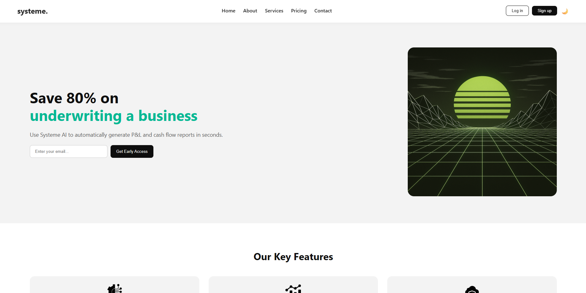

# Systeme | Smart Business Tools 🚀

A modern, responsive landing page for **Systeme**, an AI-powered business automation platform.  
Built with **HTML**, **CSS**, and **vanilla JavaScript**, featuring:

- 🌗 Light & Dark mode toggle (saved in localStorage)
- 🎯 Smooth scrolling navigation
- 💡 Responsive layout for all screen sizes
- ⚙️ Clean and scalable code structure

---

## 📂 Project Structure

```

systeme-smart-business-landing/
│
├── index.html          # Main HTML structure
├── style.css           # Styles and theme definitions
├── img/                # Image and icon assets
└── README.md           # Project documentation

````

---

## 🧠 Features

- **Modern Design** – Clean, minimal, and elegant layout  
- **Dark Mode** – Toggle button with localStorage persistence  
- **Smooth UX** – Scroll animation for all navigation links  
- **Responsive** – Works perfectly on mobile, tablet, and desktop  
- **Fast & Lightweight** – Pure front-end stack (no frameworks)

---

## 🛠️ Technologies Used

- HTML5  
- CSS3 (Flexbox + Grid)  
- Vanilla JavaScript (ES6)

---

## 🧩 How to Use

1. Clone the repository:
   ```bash
   git clone https://github.com/YOUR_USERNAME/systeme-smart-business-landing.git
    ```

2. Open the folder:

   ```bash
   cd systeme-smart-business-landing
   ```

3. Run the project locally:

   ```bash
   open index.html
   ```

   or simply drag `index.html` into your browser.

---

## 🌈 Preview



---

## 🎨 Design Inspiration

The layout and visual style of this landing page were inspired by  
[this design on Dribbble](https://dribbble.com/shots/22832848-Investment-insurance-app-hero-section-web-design-homepage).

---

### 💬 Author

**[Reza Noel]**
Frontend Developer | Creative Designer
📧 [rezatavangar112@gmail.com](mailto:rezatavangar112@gmail.com)
🔗 [LinkedIn](https://www.linkedin.com/in/rezanoel)

---

> Made with ❤️ using HTML, CSS, and JS

